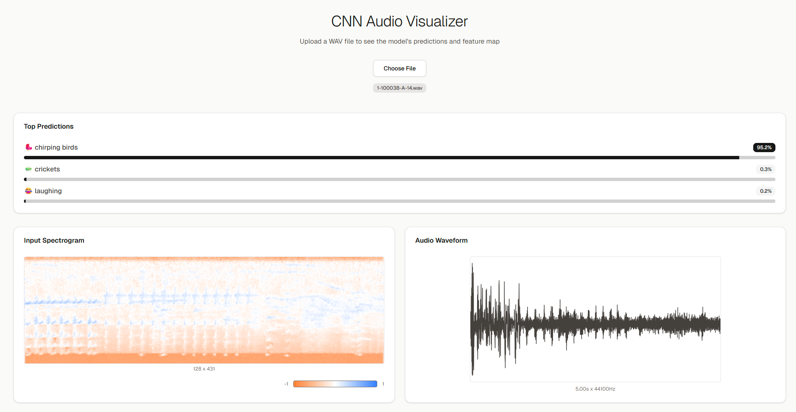

# Audio CNN

<div align="center">
    
    
    
    
    
    
</div>


## Overview
In this project, I have train and deploy an audio classification CNN from scratch with Pytorch.
The model will classify sounds like a dog barking or birds chirping from an audio file.
The model is built based on ResNet architecture (with residual network),
with advanced techniques like data mixing, and Mel Spectrogram to build a robust training pipeline.
Model was trained on the [ESC50 Dataset](https://github.com/karolpiczak/ESC-50) with 50 sound classes and GPU A10G.
Afterward, I'll build a dashboard using Next.js and React to upload and visualize the model's internal layers to see what it "sees".
The project uses Python, PyTorch, Next.js, React, and Tailwind, based on the T3 Stack.

## Feature
- 🧠 Deep Audio CNN for sound classification
- 🧱 ResNet-style architecture with residual blocks
- 🎼 Mel Spectrogram audio-to-image conversion
- 🎛️ Data augmentation with Mixup & Time/Frequency Masking
- ⚡ Serverless GPU inference with Modal
- 📊 Interactive Next.js & React dashboard
- 👁️ Visualization of internal CNN feature maps
- 📈 Real-time audio classification with confidence scores
- 🌊 Waveform and Spectrogram visualization
- 🚀 FastAPI inference endpoint
- ⚙️ Optimized training with AdamW & OneCycleLR scheduler
- 📈 TensorBoard integration for training analysis
- 🛡️ Batch Normalization for stable & fast training
- 🎨 Modern UI with Tailwind CSS & Shadcn UI
- ✅ Pydantic data validation for robust API request

## Setup
Follow these steps to install and set up the project.

**Clone the Repository**
```bash
git clone https://github.com/conbopk/Audio-CNN.git
```

**Install Python**

Download and install Python if not already installed. Use the link below for guidance on installation: [Python Download](https://www.python.org/downloads/)

Create a virtual environment with **Python 3.12**

```bash
python -m venv venv
\venv\Scripts\activate    # Window
```

**Backend**

Navigate to folder:
```bash
cd Audio-CNN
```

Install dependencies:
```bash
pip install -r requirements.txt
```

Modal setup:
```bash
modal setup
```

Run on Modal:
```bash
modal run main.py
```

**Frontend**

Install dependencies:
```bash
cd audio-cnn-visualization
npm i
```

Add your modal endpoint in your env file
```bash
NEXT_PUBLIC_INFERENCE_URL_ENPOINT="your-url-enpoint"
```

Run:
```bash
npm run dev
```